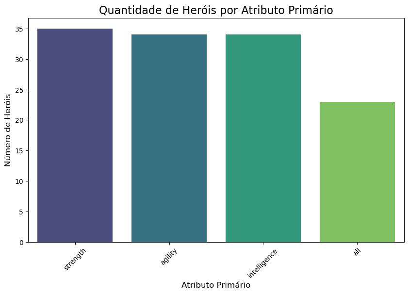
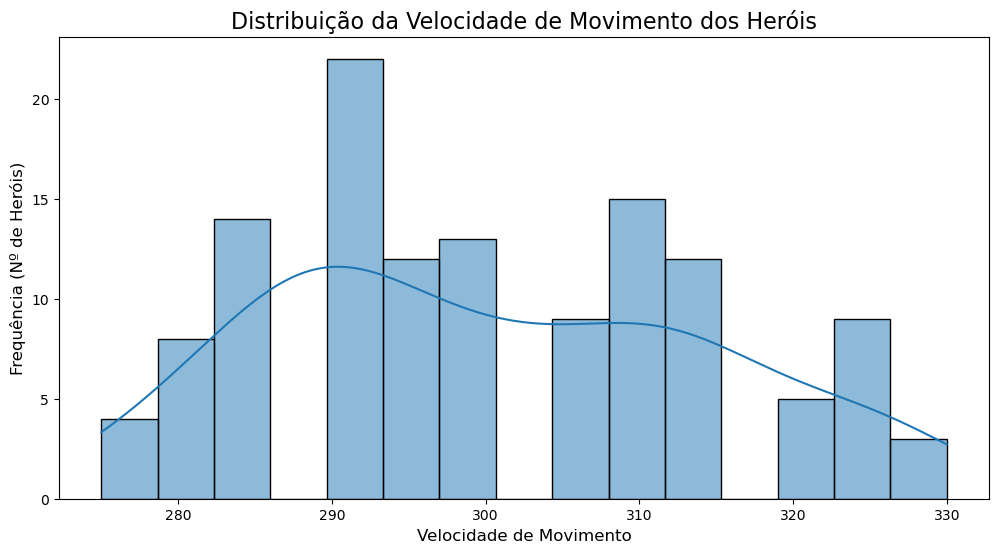
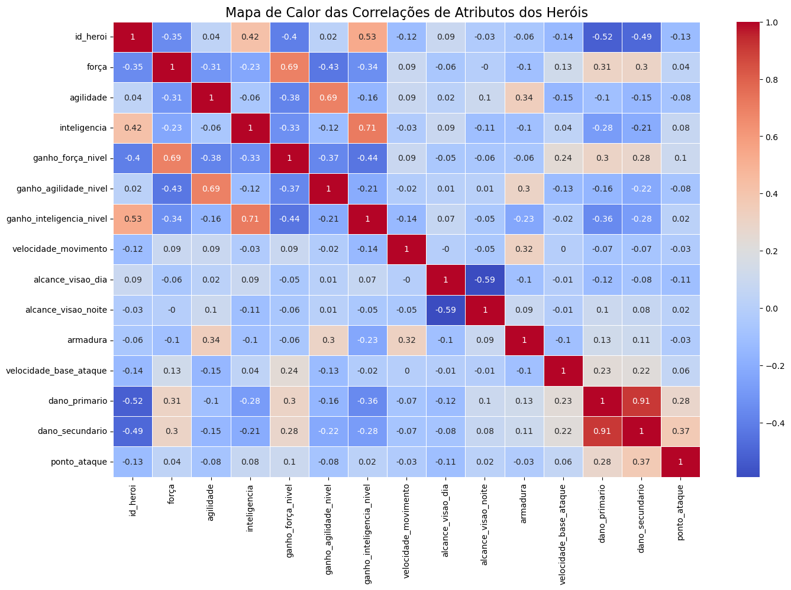

# Análise de Dados de Heróis do Dota 2 com Python e Power BI


## 📜 Visão Geral do Projeto

Este projeto consiste em uma análise exploratória de dados dos heróis do jogo Dota 2, utilizando um dataset da versão 7.38b. O objetivo principal foi aplicar e solidificar conhecimentos em Python para análise de dados, com foco especial na biblioteca **Pandas** para manipulação e análise, e nas bibliotecas **Matplotlib** e **Seaborn** para a criação de visualizações.

O processo abrange desde a leitura e limpeza dos dados, passando pela análise exploratória e extração de insights, até a criação de um dashboard interativo no **Power BI**.

## 🎯 Contexto

Como um entusiasta de Dota 2 desde 2006, este projeto une meu interesse pessoal pelo jogo com o objetivo profissional de aprimorar minhas habilidades como analista de dados. A familiaridade com o universo do jogo permitiu uma análise mais aprofundada e a formulação de perguntas relevantes para explorar os atributos e o balanceamento dos heróis.

## 💾 Dataset

O conjunto de dados foi obtido na plataforma Kaggle e contém informações detalhadas sobre os atributos de cada herói do jogo.

* **Fonte:** [Dota 2 Heroes Dataset - Kaggle](https://www.kaggle.com/datasets/abelarmando/heroesdota2)
* **Versão do Jogo:** 7.38b (lançado em 04/03/2025)
* **Formato:** CSV (`dota2_heroes.csv`)

O dataset inclui informações como: nome do herói, atributo primário, atributos base (Força, Agilidade, Inteligência), ganho de atributos por nível, velocidade de movimento, armadura, dano, entre outros.

## 🛠️ Ferramentas e Bibliotecas Utilizadas

* **Linguagem:** Python
* **Bibliotecas:**
    * **Pandas:** Para manipulação, limpeza e análise dos dados.
    * **Matplotlib & Seaborn:** Para criação de gráficos e visualizações de dados.
* **IDE:** Visual Studio Code
* **BI:** Microsoft Power BI para a criação do dashboard final.

## 📂 Estrutura do Diretório

O projeto foi organizado da seguinte forma para garantir clareza e reprodutibilidade:

```
projeto_python_dota2/
│
├── 📁 dados/
│   ├── dota2_heroes.csv              # Arquivo original
│   └── dota2_heroes_limpo.csv        # Arquivo tratado e exportado do Python
│
├── 📁 graficos_matplotlib_seaborn/
│   ├── correlacao.png
│   ├── distribuicao_movespeed.png
│   ├── herois_por_atributo.png
│   └── top10_armadura_base.png
│
├── 📁 imagens/
│   ├── dashboard_dota2.jpg           # Screenshot do dashboard
│   └── dota2_logo_nobg.png                # Logo utilizado no dashboard
│
├── 📁 scripts/
│   ├── estudo_projeto_dota2.py       # Arquivo para estudos e testes
│   └── projeto_python_dota2.py       # Script final com todo o processo de análise
│
├── 📄 projeto_python_dota2_powerbi.pbix # Arquivo do dashboard
└── 📄 README.md                       # Documentação do projeto
```

## ⚙️ Metodologia

O fluxo de trabalho foi dividido em quatro etapas principais:

1.  **ETL (Extração, Transformação e Carga):**
    * Carregamento do arquivo `.csv` utilizando Pandas.
    * Renomeação das colunas para facilitar a compreensão e manipulação (`Primary Attribute` -> `atributo_primario`).
    * Verificação de valores ausentes (`.isna().sum()`) e dados duplicados (`.duplicated().sum()`).

2.  **Análise Exploratória de Dados (EDA):**
    * Análise descritiva inicial com `.describe()` para um panorama geral dos atributos.
    * Contagem e distribuição de heróis por atributo primário.
    * Criação de rankings para identificar os heróis com os maiores valores em atributos específicos (Top 10 em força, armadura, velocidade de movimento, etc.).
    * **Engenharia de Atributos:** Criação de novas colunas para insights mais profundos, como `dano_medio_total` e `ganho_geral_atributos`.
    * Análise de perfis específicos, como "Canhões de Vidro" (alto dano, baixa armadura) e "Tanks" (alta força, alta armadura), utilizando quantis para segmentação.

3.  **Visualização de Dados (Python):**
    * Criação de gráficos para visualizar as descobertas da análise:
        * **Gráfico de Barras:** Quantidade de heróis por atributo primário.
        * **Histograma:** Distribuição da velocidade de movimento entre os heróis.
        * **Heatmap (Mapa de Calor):** Matriz de correlação entre todos os atributos numéricos para identificar relações.

4.  **Dashboard (Power BI):**
    * Exportação do DataFrame limpo para um novo arquivo CSV (`dota2_heroes_limpo.csv`).
    * Importação dos dados tratados no Power BI para a criação de um dashboard interativo.
    
## 📌 Principais Insights

* Heróis de Inteligência são mais frágeis, com menor armadura média e menor velocidade de movimento.

* Heróis de Força tendem a ser os mais equilibrados, com bom dano médio, mas crescimento mais lento de atributos.

* Não há correlações muito fortes entre atributos. Isso reforça o equilíbrio proposital do jogo em relações às bases dos heróis. O que diferencia um herói estar no meta ou não é a combinação complexa desses atributos com suas habilidades, facets, configuração do mapa, etc.

## 📊 Visualizações e Dashboard

### Gráficos Gerados em Python

| Gráfico de Barras - Heróis por Atributo | Histograma - Velocidade de Movimento |
| :--------------------------------------: | :----------------------------------------: |
|  |  |

**Mapa de Calor das Correlações**

*A análise da matriz de correlação revelou que não há correlações muito fortes entre os atributos, o que pode sugerir um bom trabalho de balanceamento base dos heróis no jogo.*

### Dashboard no Power BI

Foi desenvolvido um dashboard que consolida as principais informações da análise, permitindo uma visualização interativa e filtragem por herói ou atributo primário.


## 💡 Conclusão e Aprendizados

Este projeto foi fundamental para a prática e fixação dos conceitos da biblioteca Pandas. A decisão de usar um tema de interesse pessoal tornou o processo de aprendizado mais envolvente e eficaz. Diferente de projetos anteriores com foco intenso em ETL, este permitiu uma dedicação maior ao aprendizado da ferramenta e à fase de análise exploratória e visualização de dados.

Os próximos passos incluem o desenvolvimento de projetos com maior complexidade, mais próximos de cenários de negócios reais, para continuar a evolução no fluxo de trabalho de um analista de dados.